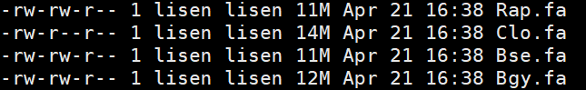

# 低拷贝基因家族正选择分析

[TOC]


## 1. 基因家族聚类

### 1.1 protein和cds文件预处理

#### 1.1.1 命名

用于分析的文件命名为：[A-Za-z]{3}.fa



#### 1.1.2 根据长度筛选cds和protein序列

```bash
perl ../scripts/1.filter_fasta_by_length_and_sort.pl LENGTH Prefix.fa Prefix.Passed.fa Prefix.unpassed.fa Prefix.length.txt

# LENGTH: 长度小于这个值的序列会被filter掉
# Prefix.length.txt：每条序列的长度，可以用于检查长度分布
```

#### 1.1.3 添加物种名

```
perl ../scripts/2.add_species_name_to_fa_sequences.pl Prefix.fa
```

#### 1.1.4 最终序列格式

用于分析的序列的名称是>[a-zA-Z]{3}|.*


---

### 1.2 orthofinder做基因家族聚类

#### 1.2.1 直接运行

```bash
orthofinder -t 10 -a 5 -S diamond -og -f INPUT_DIR

	-t, Number of parallel sequence search threads [Default = 16]
	-a, Number of parallel analysis threads [Default = 1]
	-S, Sequence search program [Default = blast]. Options: blast, blast_gz, diamond
	-og, Stop after inferring orthogroups
	-f, Input dir containing all protein files
```

#### 1.2.2 在原有结果的基础上添加物种

```bash
orthofinder -b previous_orthofinder_directory -f new_fasta_directory

# This will add each species from the 'new_fasta_directory' to existing set of species, reuse all the previous BLAST results, perform only the new BLAST searches required for the new species and recalculate the orthogroups. The 'previous_orthofinder_directory'  is the OrthoFinder 'WorkingDirectory/' containing the file 'SpeciesIDs.txt'.
```

#### 1.2.3 在原有结果中删除物种

```bash
orthofinder -b previous_orthofinder_directory

# In the 'WorkingDirectory/' from a previous analysis there is a file called 'SpeciesIDs.txt'. Comment out any species to be removed from the analysis using a '#' character and then run OrthoFinder using the command above. The 'previous_orthofinder_directory'  is the OrthoFinder 'WorkingDirectory/' containing the file 'SpeciesIDs.txt'.
```

#### 1.2.4 同时进行添加和删除操作

```bash
orthofinder -b previous_orthofinder_directory -f new_fasta_directory

# 结合上面的两个就知道了
```

---

## 2. 挑选低拷贝基因家族中的最佳匹配序列

### 2.1 挑选低拷贝基因家族，提取其中的序列

[^ Note]: Working directory is `Orthogroup_Sequence` dir. 这里的筛选标准是：以拟南芥为外群，所以要求该基因家族中包含仅一个拟南芥的基因，其它物种则至少有一个基因，至多有三个基因。

```
perl 3.extract_low_copy_gf_seqs.pl ../Orthogroups/Orthogroups.GeneCount.tsv
mkdir fas
mv *fa fas
```

### 2.2 挑选跟外群最相似的序列

```bash
perl 4.mkblastdb_sh.pl 
perl 5.create_blast_sh.pl
mkdir fas && mv *fa fas && rm -rf OG*p* && mkdir blastouts && cd blastouts
perl 6.grep_besthit_by_score.pl
mkdir blastouts && mkdir besthits && mkdir besthit_seqs && mv *out blastouts && rm -f *besthit  
perl 7.Extract_Pep_Cds_Seq.pl allcds.fa allpep.fa Best_Hit.genelist
mkdir cdss && mkdir peps && mv *cds cdss && mv *pep peps
perl 8.create_mafft_sh.pl mafft.sh mafftseqs
bash mafft.sh >mafft.log 2>>mafft.err 
mkdir mafftout
mv mafft* mafftout
perl 9.sort_cds_mafft.pl mafftoutdir/mafftseqs cdss sortedcdsdir
perl 10.create_pal2aln.pl mafftoutdir/mafftseqs sortedcdsdir pal2nalfas pal2nal.sh
nohup bash pal2nal.sh >pal2nal.log 2>>pal2nal.err &
mkdir pal2naloutdir
mv pal2nal* err* pal2naloutdir
perl 11.create.gblocks_sh.pl pal2naloutdir/pal2nalfas gblockshtms gblocks.sh
bash gblocks.sh
mkdir gblocksoutdir
mkdir gblocksgbs
mv pal2naloutdir/pal2nalfas/*htm gblockshtms
mv pal2naloutdir/pal2nalfas/*gb gblocksgbs
mv gblocks* gblocksoutdir
cd gblocksoutdir/gblocksgbs
perl 12.gb2phy.pl
mkdir phys
mv *phy phys && mv phys ..
```

### 2.3 使用codeml的branch-site model进行正选择分析

[教程一]:https://www.jianshu.com/p/152a6216c794
[教程二]: https://www.cnblogs.com/bio-mary/p/12923978.html
[EasyCodeml]: https://blog.sciencenet.cn/blog-460481-1163040.html

[^LRT检验]: 即对两个模型进行显著性水平比较，可以使用PAML软件自带Chi2子程序进行计算。先计算两个对应模型 Ln L 差值，并取绝对值后的数值乘以2，即2△Ln L =|Ln L 1-Ln L2|。利用paml自带的Chi2程序计算P值，命令为：Chi2  1  2.03（2为自由度df，branch-site models中df通常使用1；2.03为2△Ln L）。输出值 prob <0.05视为显著，可认为该基因受到正选择。

```bash
perl 13.create_codeml_sh.pl
mkdir m0s && mv *m0 m0s 
mkdir mas && mv *ma mas
grep "lnL" m0s/* >m0.lnL
grep "lnL" mas/* >ma.lnL
perl 14.LRT.pl m0.lnL ma.lnL
```

[note]: 树文件放在同一个文件夹下，命名为`speciestree.tree`，格式如下：

```
# 这里用#标记前景支
10 1
(Ath,((Rco,(Peu,Ptr)),(Clo,(Rap,(Bpa,(Bcy,(Bgy #1,Bse)))))));

# 如果是一整个clade也可以用$符号做标记前景支
10 1
(Ath,((Rco,(Peu,Ptr)),(Clo,(Rap,(Bpa,(Bcy,(Bgy,Bse)))$1))));
```

### 2.4 根据拟南芥的基因做功能的注释

```bash
```


## Scripts

#### 1.filter_fasta_by_length_and_sort.pl

```perl
#Usage: perl *pl Length_threshlod IN.fa passed.fa unpassed.fa Length_of_scaffold.txt
use Bio::SeqIO;

$length_threshold=$ARGV[0];
open CACHE,">>CACHE";
open PASSED,">>$ARGV[2]";
open FILTERED,">>$ARGV[3]";
open LEN,">>$ARGV[4]";

my $in=Bio::SeqIO->new(-format=>'fasta',
                    -file=>"$ARGV[1]");

while (my $seq=$in->next_seq) {
                $id=$seq->id;
                $length=$seq->length;
                $base=$seq->seq;
#print "$id\t$length\t$base\n";
                if ($length<=$length_threshold) {
                        print FILTERED ">$id\n$base\n";
                } else {
                        print CACHE ">$id\n$base\n";
                }
}
close FILTERED;
close CACHE;

my $in=Bio::SeqIO->new(-format=>"fasta",
                                        -file=>"CACHE");

while (my $seq=$in->next_seq) {
                $id=$seq->id;
                $length=$seq->length;
                $base=$seq->seq;

                $id{$length}=$id;
                $base{$id}=$base;
}
@length=sort {$b<=>$a} keys %id;
foreach $length (@length) {
        print PASSED ">$id{$length}\n$base{$id{$length}}\n";
        print LEN "$id{$length}\t$length\n";
}

close LEN;
close PASSED;
close CACHE;
unlink CACHE;
```

#### 2.add_species_name_to_fa_sequences.pl

```perl
use autodie;

my $name=$ARGV[0];
$name=~s/\.fa//;
open IN,"<$ARGV[0]";
open OUT,">bak";

while (<IN>) {
        if (/^>/) {
                s/\s+$//;
                $a=(split/\s+/,$_)[0];
                $a=~s/^>//;
                $a=">$name|" . "$a";
                print OUT "$a\n";
        } else {
                print OUT;
        }
}
close IN;
close OUT;
`mv bak $ARGV[0]`;
```

#### 3.extract_low_copy_gf_seqs.pl

```perl
die "Usage: perl $0 Orthogroups.GeneCount.tsv\n" if @ARGV!=1;

L: while (<>) {
        if (/^Or/) {next L}
        s/\s+$//;
        my @eles=split/\s+/;
        my $OG=shift @eles;
        my $ath=$eles[0];
        next if $ath !=1;
        for ($m=0;$m<$#eles;$m++) {
                next L if ($eles[$m]>3 || $eles[$m]==0);
        }
        push @OGs,$OG;
}
`mkdir lowcopy`;
my @fas=glob("*fa");
foreach my $fa (@fas) {
        $fa=~m/(OG\d+)\.fa/;
        my $OG=$1;
        `cp $fa lowcopy` if $OG~~@OGs;
}
```

#### 4.create_mkblastdb_sh.pl

```perl
my @fas=glob("*fa");
open SHS,">","mkblastdb.sh";
foreach my $fa (@fas) {
        $fa=~m/(OG\d+)\.fa/;
        my $prefix=$1;
        print SHS "makeblastdb -in $fa -out $prefix -dbtype prot\n";
}

`split -l 1000 split -l 1000 -d -a 1 mkblastdb.sh mkblastdb_`;

my @shs=glob("mkblastdb_*");
foreach my $sh (@shs) {
        `nohup bash $sh &`;
}
```

#### 5.create_blast_sh.pl

```perl
my @fas=glob("*fa");
open BLS,">","blast.sh";
foreach my $fa (@fas) {
		$fa=~m/(OG\d+)\.fa/;
		my $prefix=$1;
		print BLS "blastp -query $fa -db $prefix -outfmt 6 -num_threads 5 -evalue 1e-5 -out $prefix.out\n"
}

`split -l 1000 split -l 1000 -d -a 1 blast.sh blast_`;

my @shs=glob("blast_*");
foreach my $sh (@shs) {
        `nohup bash $sh &`;
}
```

#### 6.grep_besthit_by_score.pl

```perl
use autodie;
use strict;

my @blastouts=glob("*out");

foreach my $blastout (@blastouts) {

        open BLASTOUT,"<","$blastout";
        open GENELIST,">>","Best_Hit.genelist";

        my (%Best_Hit_Score,%Best_Hit_Line,%Best_Hit_Query_Gene);

        L: while (<BLASTOUT>) {
                s/\s+$//;
                my $Line=$_;
                my ($Ref,$Query,$Score)=(split/\s+/)[0,1,-1];
                $Query=~m/^(\w{3})\|/;
                my $Query_Spe=$1;
                next L if (($Ref=~m/Ath/)==0);
                if ($Score>=$Best_Hit_Score{$Query_Spe} || !exists $Best_Hit_Score{$Query_Spe}) {
                        $Best_Hit_Score{$Query_Spe}=$Score;
                        $Best_Hit_Line{$Query_Spe}=$Line;
                        $Best_Hit_Query_Gene{$Query_Spe}=$Query;
                }
        }

        $blastout=~m/(\w+)\.out/;
        my $OG=$1;
        print GENELIST "$OG\t";
        my $Best_Hit_Blastout="$OG.besthit";
        open BHOUT,">","$Best_Hit_Blastout";

        foreach my $Query_Spe (keys %Best_Hit_Score) {
                print BHOUT "$Best_Hit_Line{$Query_Spe}\n";
                print GENELIST "$Best_Hit_Query_Gene{$Query_Spe}\t";
        }

        print GENELIST "\n";

        undef %Best_Hit_Score;
        undef %Best_Hit_Line;
        undef %Best_Hit_Query_Gene;
}
```

#### 7.Extract_Pep_Cds_Seq.pl

```perl
use autodie;
use strict;

open CDS,"<","$ARGV[0]";
open PEP,"<","$ARGV[1]";
open GENELIST,"<","$ARGV[2]";

my ($Gene_Name,%Cds,%Pep);
while (<CDS>) {
	s/\s+$//;
	if (/^\>/) {
		s/^\>//;
		$Gene_Name=$_;
	} else {
		$Cds{$Gene_Name}.=$_;
	}
}
close CDS;


while (<PEP>) {
	s/\s+$//;
	if (/^\>/) {
		s/^\>//;
		$Gene_Name=$_;
	} else {
		$Pep{$Gene_Name}.=$_;
	}
}
close PEP;


while (<GENELIST>) {
	s/\s+$//;
	my @eles=split/\s+/;
	my $OG=shift @eles;
	open PEPSEQ,">","$OG.pep";
	open CDSSEQ,">","$OG.cds";
	foreach my $Gene (@eles) {
		print PEPSEQ "$Pep{$Gene}\n";
		print CDSSEQ "$Cds{$Gene}\n";
		warn "Cannot find the CDS sequence of Gene $Gene in $OG\n" if !exists $Cds{$Gene};
		warn "Cannot find the protein sequence of Gene $Gene in $OG\n" if !exists $Pep{$Gene};		
	}
}
close GENELIST;
```

#### 8.create_mafft_sh.pl

```perl
use warnings;
use strict;
my $homolog_dir=shift;
my @files=<$homolog_dir/*>;
my $output_sh=shift;
open (O,">$output_sh");

my $outdir=shift;
system("mkdir $outdir");
foreach my $file (@files){
    $file=~/OG(\d+)/;
    my $sign=$1;
    my $outfile="$outdir/mafft$1";
    print O "mafft --maxiterate 1000 --localpair $file >$outfile\n";
}
close O;
```

#### 9.sort_cds_mafft.pl

```perl
use warnings;
use strict;

use Bio::SeqIO;
my $mafftdir=shift;
my @pepfiles=<$mafftdir/*>;
my $cdsdir=shift;
my $outdir=shift;
system ("mkdir $outdir");

foreach my $pepfile (@pepfiles){
    $pepfile=~/mafft(\d+)/;
    my $sign=$1;
    my $cdsfile="$cdsdir/OG$sign.cds";

    my %pep;
    my $count=0;
    my $fa_P=Bio::SeqIO->new(-file=>$pepfile,-format=>'fasta');
    while (my $seq_obj=$fa_P->next_seq){
    my $pep_id=$seq_obj->display_name;
    $pep_id=~/^(\w+)\|(.+)/;
    my $species=$1;
    my $pepid=$2;
    $count++;
    $pep{$count}=$species;
    }

    my %nucle;
    my $fa_c=Bio::SeqIO->new(-file=>$cdsfile,-format=>'fasta');
    while (my $seq_obj=$fa_c->next_seq){
    my $nuc_id=$seq_obj->display_name;
    my $seq=$seq_obj->seq;
    $nuc_id=~/^(\w+)\|(.+)/;
    my $species=$1;
    my $nucid=$2;
    $nucle{$species}{$nuc_id}=$seq;
    }

    my $output="$outdir/paltoaln$sign";
    open(O,">$output");
    my @order=sort {$a<=>$b} keys %pep;
    foreach my $order (@order){
    my $species=$pep{$order};
    my @id=keys %{$nucle{$species}};
    foreach my $id (@id){
        print O ">$id\n$nucle{$species}{$id}\n";
    }
    }
    close O;
}
```

#### 10.create_pal2aln.pl

```perl
use warnings;
use strict;
my $pepdir=shift;
my @mafftfiles=<$pepdir/*>;
my $cdsdir=shift;
my $outdir=shift;
system ("mkdir $outdir");
my $output_sh=shift;
open(O,">$output_sh");

my $pal2alnpath="~/software/pal2nal.v14/pal2nal.pl";
foreach my $pepfile (@mafftfiles){
    $pepfile=~/mafft(\d+)/;
    my $sign=$1;
    print O "perl $pal2alnpath $pepfile $cdsdir/paltoaln$sign -output fasta >$outdir/pal2aln_$sign\n";
}
close O;
```

#### 11.create.gblocks_sh.pl

```perl
use strict;
my $pepdir=shift;
my @files=<$pepdir/pal*>;
my $logdir=shift;
system ("mkdir $logdir");
my $output_sh=shift;
open(O,">$output_sh");

my $gblockspath="~/software/Gblocks_0.91b/Gblocks";
foreach my $pepfile (@files){
    print O "$gblockspath $pepfile -t=c\n";
}
close O;
```

#### 12.gb2phy.pl

```perl
my @gbs=glob("*gb");

foreach my $gb (@gbs) {
	open GB,"<","$gb";
	while (<GB>) {
		if (/^>/) {
			$_=~m/\>(\w{3})\|/;
			$spe=$1;
		} else {
			s/\s+//g;
			$seq{$spe}.=$_;
		}
	}
	$phy="$gb.phy";
	open PHY,">","$phy";
	my @spes=sort keys %seq;
	my $spe_num=@spes;
	my $length=length $seq{$spes[1]};
	print PHY "$spe_num $length\n";
	foreach my $spe (@spes) {
		print PHY "$spe  $seq{$spe}\n";
	}
	undef %seq;
}
```

#### 13.create_codeml_sh.pl

```perl
my @phys=glob("*phy");

foreach my $phy (@phys) {

open SH,"<<","codeml.sh";
	my ($prefix=$phy)=~s/\.phy//;
	open MA,"<","$prefix.ma.ctl";
	print MA "seqfile = $phy;
treefile = speciestree.tree
outfile = $phy.ma
noisy = 3
verbose = 0
runmode = 0
seqtype = 1 
CodonFreq = 2
clock = 0 
model = 2
NSsites = 2
icode = 0
Mgene = 0
fix_kappa = 0 
kappa = 1.234567
fix_omega = 0
omega = 1.414
fix_alpha = 1
alpha = 0
ncatG = 3
getSE = 1
Small_Diff = .5e-6
*    cleandata = 0
*        ndata = 10
*  fix_blength = 0
method = 0";

	open M0,"<","$prefix.m0.ctl";
	print M0 "seqfile = $phy
treefile = speciestree.tree
outfile = $phy.m0
noisy = 3
verbose = 0
runmode = 0
seqtype = 1 
CodonFreq = 2
clock = 0 
model = 2
NSsites = 2
icode = 0
Mgene = 0
fix_kappa = 0 
kappa = 1.234567
fix_omega = 1
omega = 1
fix_alpha = 1
alpha = 0
ncatG = 3
getSE = 1
Small_Diff = .5e-6
*    cleandata = 0
*        ndata = 10
*  fix_blength = 0
method = 0";

open SH0,">>","codeml.m0.sh";
open SHA,">>","codeml.ma.sh";
print SH0 "codeml $prefix.m0.ctl\n";
print SHA "codeml $prefix.ma.ctl\n";
}

`split -l 500 -d -a 2 codeml.m0.sh codeml.m0.sh_`;

my @m0shs=glob("codeml.m0.sh_*");
foreach my $m0sh (@m0shs) {
        `nohup bash $m0sh &`;
}

`split -l 500 -d -a 2 codeml.ma.sh codeml.ma.sh_`;

my @mashs=glob("codeml.ma.sh_*");
foreach my $mash (@mashs) {
        `nohup bash $mash &`;
}
```

#### 14.LRT.pl

```perl
open M0,"<","$ARGV[0]";
open MA,"<","$ARGV[1]";

my @fas;

my %M0_lnL;
while (<M0>) {
	s/\s+$//;
	$_=~m/(?<fa>pal.*)\.m0:lnL.*(?<lnL>\-\d+).*/;
	my $fa=$+{fa};
	push @fas,$fa;
	my $M0_lnL=$+{lnL};
	$M0_lnL{$fa}=$M0_lnL;
}

my %Ma_lnL;
while (<MA>) {
	s/\s+$//;
	$_=~m/(?<fa>pal.*)\.ma:lnL.*(?<lnL>\-\d+).*/;
	my $fa=$+{fa};
	my $Ma_lnL=$+{lnL};
	$Ma_lnL{$fa}=$Ma_lnL;
}

my %delta_lnLs;
foreach my $fa (@fas) {
	my $delta_lnL=abs($Ma_lnL{$fa}-$M0_lnL{$fa});
	$delta_lnLs{$fa}=2*$delta_lnL;
}

my @fas=sort {$delta_lnLs{$b}<=>$delta_lnLs{$a}} keys %delta_lnLs;
open POS,">positive_selected.txt";
open NON,">non_positive_selected.txt";
foreach my $fa (@fas) {
	if ($delta_lnLs{$fa}>=2.7055) {
		print POS "$fa\t$delta_lnLs{$fa}\n";
	} else {
		print NON "$fa\t$delta_lnLs{$fa}\n";
	}
}
```

